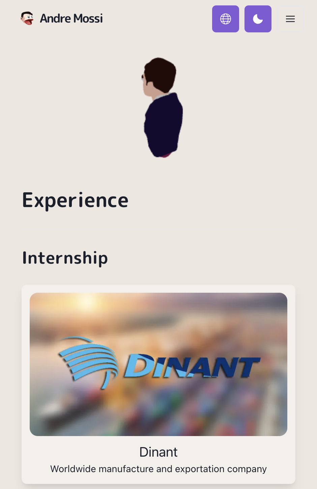

<h1 align="center">My Portfolio</h1>

Link: [`https://andremossi.vercel.app/`](https://andremossi.vercel.app/)

    
    

<h2>Tools ⚒️</h2>

- [`Next.js`](https://nextjs.org/) - React framework
- [`Chakra UI`](https://chakra-ui.com/) - UI building blocks for react
- [`Three.js`](https://threejs.org/) - 3D models rendered
- [`Frame Motion`](https://www.framer.com/motion/) - Animation library
- [`React`](https://react.dev/) - Library for web and native user interfaces

<h2>Globalization 🌐</h2>

Currently I have the capability of speaking fluently two languages being English and Spanish.
In order to showcase my ability I had decided to add translation option settings.
The website as of now supports the following languages:

- English
- Spanish

I used react internationalization to apply the ability of multiple languages and it gets the translation from json files which I created.

__*I am striving to have native-like fluency in English. Feedback is appreciated.*__

<h2>License 🪪</h2>

Anyone can use my website as a template or for learning purposes. As long
as my drawings, pictures, and 3D models are not used in your projects.

[License](https://github.com/AndreM222/AndreMossi-Portfolio/blob/master/License)
